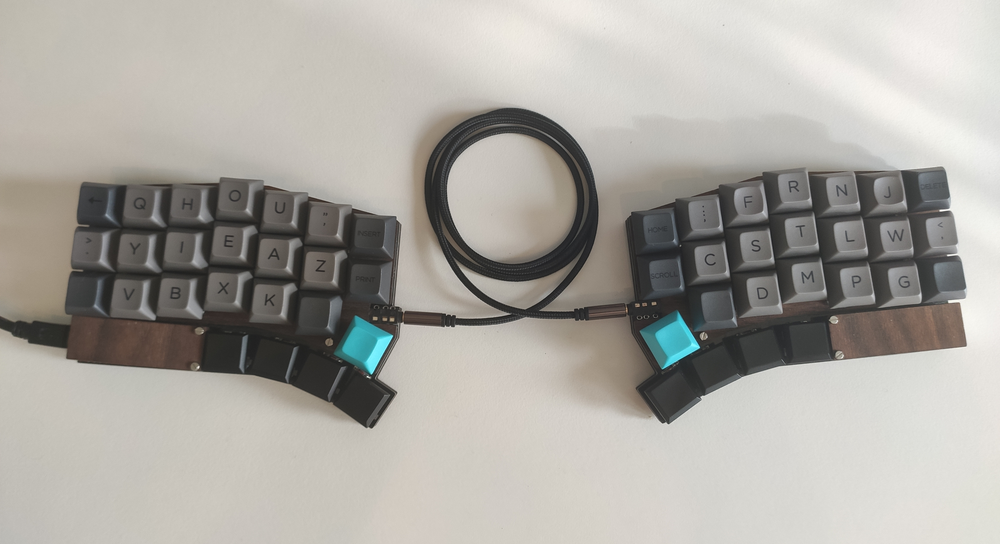

# Tabhou - A Perfectly Symmetric Keyboard Layout

|  |
|:--:|
| *Tabhou on the [Pinky3](https://github.com/tamanishi/Pinky3)* | 

A keyboard layout designed for me, by me. I have very short stubby fingers making regular ten finger touch typing on any keyboard a difficult and unpleasant task. The layout is made for ortholinear keyboards and is not designed to work on regular staggered keyboards. 

## Focuses
#### Symmetry and comfort
It always bothered me that every keyboard layout I tried put different levels of strain on both your hands. Typing on dvorak had my right hand all over the place while my left hardly ever moved. Those constant wrist movements I found to be very annoying, and after trying a handful of keyboard layouts I decided to design a keyboard layout which ruled out almost all wrist movements by centering all letters and common keys under your fingers.

#### Alternation and rolls
The left side and right both serve a purpose. The left contains all vowels and less common consonants while the right consists of just consonants. The reason for this is to promote alternation while typing.

The positioning of all the letters where mainly determined by two factors. Letter frequency and bigrams/trigrams. My pinky fingers are abnormally short and lack strength so vowels and frequent letters like S, T, R etc. are all located in the upper middle position on each hand. With these in place I began working with the bigrams and trigrams on each hand. Trying to get as many rolls in place as I could while still keeping the symmetry of the layout intact. The left hand is similar to that on the [BEAKL15](https://ieants.cc/code/keyboard/beakl/index.php) layout. Which is the layout I initially started modifying. Anyway, most of my time was spent on the right which was simply a matter of trial and error until I got a layout which was both comfortable and efficient to type on.

#### Layers
How do I type numbers? Well with the help of layers of course. The keyboard has four different layers, one for letters, one for numbers, one for special characters and lastly one for function keys. These layers are accessed by holding down the UP and DOWN keys on my thumb row. And it is with the help of layering that I am able to remove wrist movements entirely.
