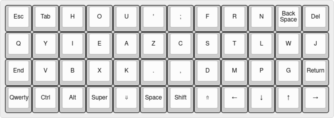

# Tabhou - A Perfectly Symmetric Keyboard Layout

A keyboard layout designed for me, by me. I have very short stubby fingers making regular ten finger touch typing on any keyboard a difficult and unpleasant task. The layout is made for ortholinear keyboards and is not designed to work on regular staggered keyboards. 

## Focuses
#### Symmetry and comfort
It always bothered me that every keyboard layout I tried put different levels of strain on both your hands. Typing on dvorak had my right hand all over the place while my left hardly ever moved. Those constant wrist movements I found to be very XXXXXXX, which eventually led me to designing a layout which ruled out almost all wrist movements by centering all letters and common keys under your fingers. 

#### Alternation and rolls
The left side and right both serve a purpose. The left contains the vowels and less common consonants while the right contains the more frequently used consonant. The reason for this is to promote alternation while typing i.e. every other keystroke on the other hand.

The positioning of all the letters where mainly determined by two factors. Letter frequency and bigrams. My pinky fingers are abnormally short and lack strength so vowels and frequent letters like S, T, R etc. are all located in the upper middle position on each hand. With these in place I began working with the bigrams on each hand. Trying to get as many rolls in place as I could while still keeping the symmetry of the layout intact. The left hand very similar to that on the [BEAKL15](https://ieants.cc/code/keyboard/beakl/index.php) layout. Which is the layout I initially started modifying. Anywas, most of my time was spent on the right which was simply a matter of trial and error until I got a layout which was both comfortable and efficient to type on.
